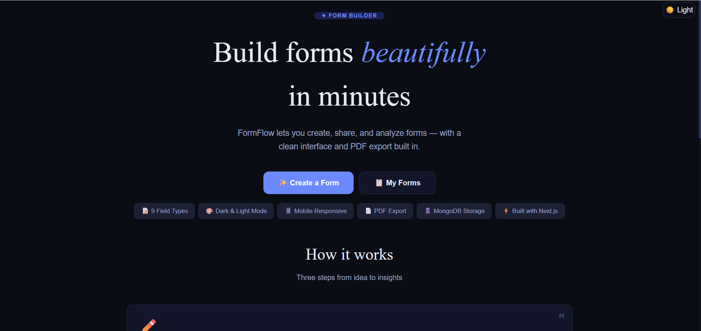
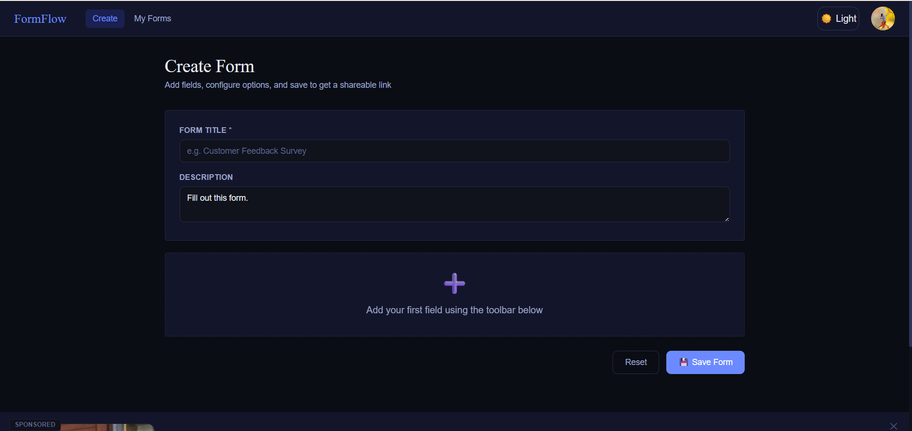
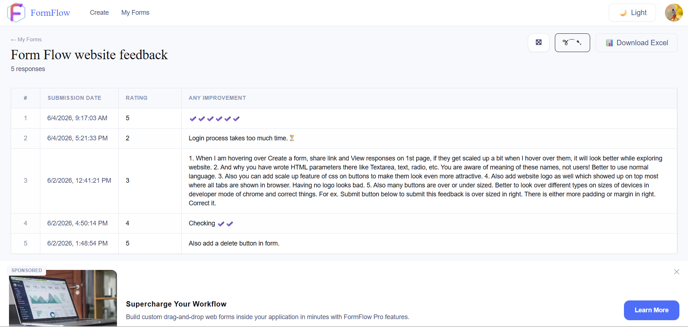
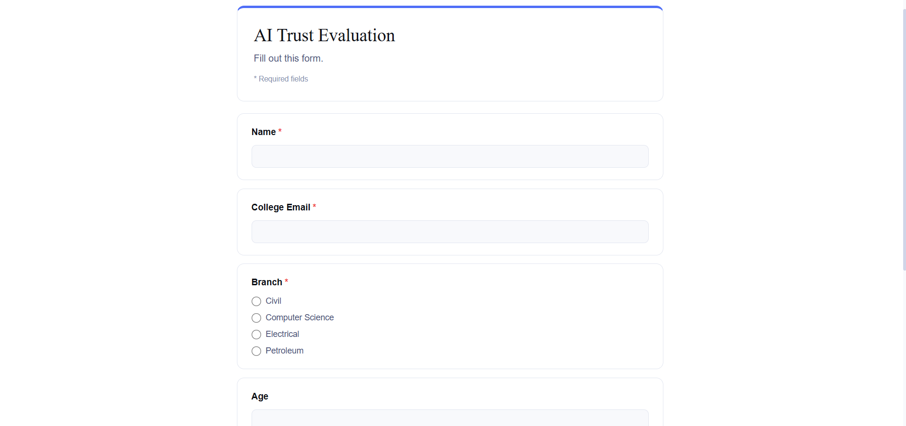

# FormFlow

A modern form builder and response management platform inspired by Google Forms.

[🔗 Live Demo](https://form-flow-ashen.vercel.app/)

## Features

* Google Authentication with Firebase
* Create and manage forms
* Share forms using unique links
* Collect responses in real-time
* Export responses to Excel
* Protected dashboard routes
* Responsive UI
* Firestore database integration
* Form ownership and access control
* Public form submission support

## Tech Stack

### Frontend

* React.js
* React Router DOM
* Tailwind CSS
* Zustand

### Backend & Database

* Firebase Authentication
* Cloud Firestore

### Deployment

* Vercel

## Screenshots

* Home Page


* Form Builder


* Response Dashboard


* Form Preview


## Installation

Clone the repository:

```bash
git clone <your-repository-url>
```

Move into the project:

```bash
cd formflow
```

Install dependencies:

```bash
npm install
```

Create a `.env` file in the root directory:

```env
VITE_FIREBASE_API_KEY=
VITE_FIREBASE_AUTH_DOMAIN=
VITE_FIREBASE_PROJECT_ID=
VITE_FIREBASE_STORAGE_BUCKET=
VITE_FIREBASE_MESSAGING_SENDER_ID=
VITE_FIREBASE_APP_ID=
```

Start the development server:

```bash
npm run dev
```

## Project Structure

```text
src/
├── components/
├── pages/
├── utils/
├── main.jsx
├── router.jsx
```

## How It Works

### Form Creation

Users can create custom forms with multiple fields and configure form settings.

### Sharing

Each form generates a unique shareable URL.

### Response Collection

Responses are stored securely in Firestore and linked to their respective forms.

### Analytics & Export

Form owners can view submissions and export responses to Excel.

## Security

* Firebase Authentication
* Protected Routes
* Firestore Security Rules
* Form Ownership Validation

## Future Improvements

* File Upload Questions
* Response Analytics Dashboard
* Custom Themes
* Email Notifications
* Team Collaboration
* AI-assisted Form Generation

## Author

Mahadev

## License

This project is licensed under the MIT License.

## LinkedIn

```text
🚀 Built **FormFlow** – A Modern Form Builder Platform

I'm excited to share one of my recent projects, **FormFlow**, a Google Forms-inspired application built with React and Firebase.

🔗 Live Demo: https://form-flow-ashen.vercel.app/
🔗 Live Demo: https://github.com/rajmahadev422/form-flow.git

### Features

✨ Google Authentication
✨ Create, edit, and manage forms
✨ Share forms using unique URLs
✨ Real-time response collection
✨ Export responses to Excel
✨ Light & Dark Mode support
✨ Advertisement display components
✨ Protected routes and secure access control
✨ Responsive design for all devices
✨ Firestore database integration

### Tech Stack

🔹 React.js
🔹 Tailwind CSS
🔹 React Router DOM
🔹 Zustand
🔹 Firebase Authentication
🔹 Cloud Firestore
🔹 Vercel

### What I Learned

📌 Authentication and user management with Firebase
📌 Firestore database design and security rules
📌 Route protection and access control
📌 Dynamic form creation and response handling
📌 State management with Zustand
📌 Theme management (Light/Dark Mode)
📌 Deploying production-ready applications

This project helped me strengthen my full-stack development skills and gain practical experience building scalable web applications.

Feedback and suggestions are always welcome!

#ReactJS #Firebase #WebDevelopment #FrontendDeveloper #JavaScript #TailwindCSS #FullStackDevelopment #PortfolioProject #BuildInPublic #SoftwareEngineering #OpenToWork
```
